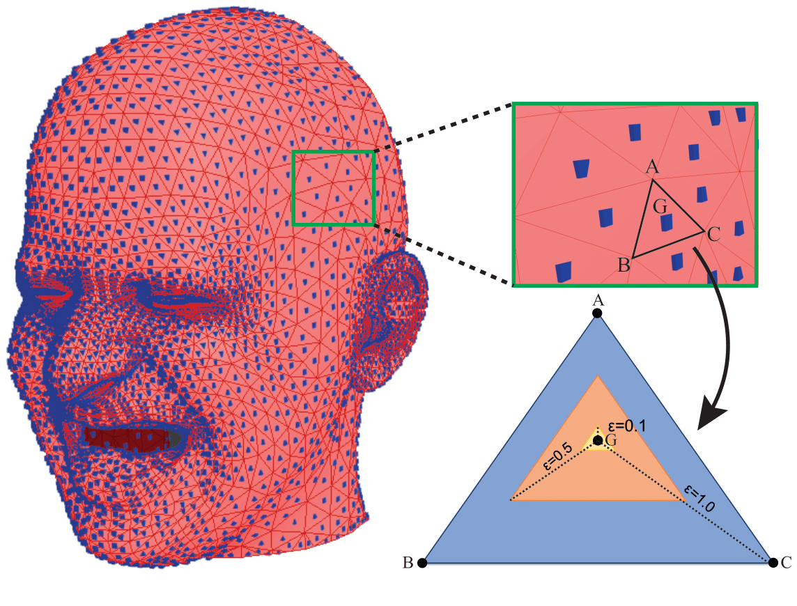
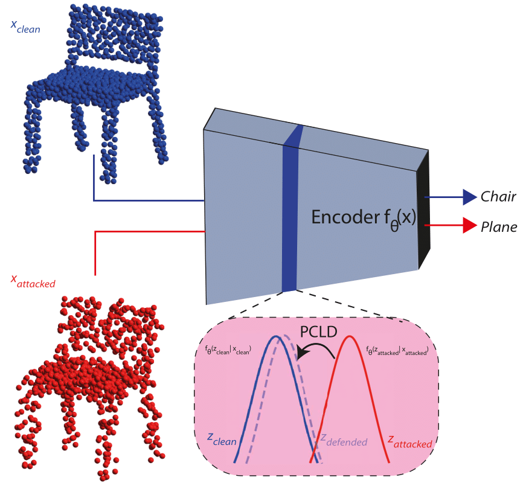
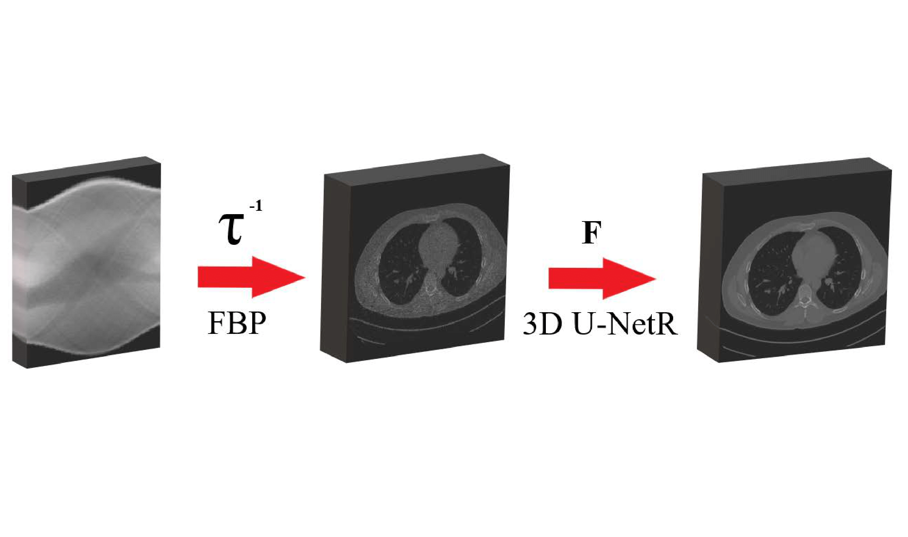

Welcome to my homepage! My name is Batuhan Cengiz. I am a PhD Student and a Research Assistant at the [Istanbul Technical University](https://ituvisionlab.github.io/), supervised by [Gozde Unal](https://gozde-unal.github.io/). I have received my Bachelor's and Master's also from Istanbul Technical University. My main research is focused on 3D Vision, robustness, and generative models.

## Research

<ul>
  <li class="research-item">
    
    

      <b>&epsilon;-Mesh Attack: A Surface-based Adversarial Point Cloud Attack for Facial Expression Recognition</b>
      
         Batuhan Cengiz, Mert Gulsen, Yusuf H. Sahin, Gozde Unal 
        IEEE International Conference on Automatic Face and Gesture Recognition, 2024 
        <a href="https://arxiv.org/pdf/2403.06661">Paper</a>, <a href="https://github.com/batuceng/e-mesh-attack">Code</a>
      
    

  </li>
  <li class="research-item">
    
    

      <b>PCLD: Point Cloud Layerwise Diffusion for Adversarial Purification</b>
      
        Mert Gulsen, Batuhan Cengiz, Yusuf H. Sahin, Gozde Unal 
        Arxiv (Accepted at IEEE ICIP), 2024 
        <a href="https://arxiv.org/pdf/2403.06698">Paper</a>, <a href="https://github.com/batuceng/diffusion-layer-robustness-pc">Code</a>
      
    

  </li>
  <li class="research-item">
    
    

      <b>3D U-NetR: Low Dose Computed Tomography Reconstruction via Deep Learning and 3 Dimensional Convolutions</b>
      
        Doga Gunduzalp*,  Batuhan Cengiz*, Mehmet Ozan Unal, Isa Yildirim 
        Arxiv, 2021 
        *Denotes Equal Contribution 
        <a href="https://arxiv.org/pdf/2105.14130">Paper</a>, <a href="https://github.com/batuceng/3D_UNetR">Code</a>
      
    

  </li>
</ul>
